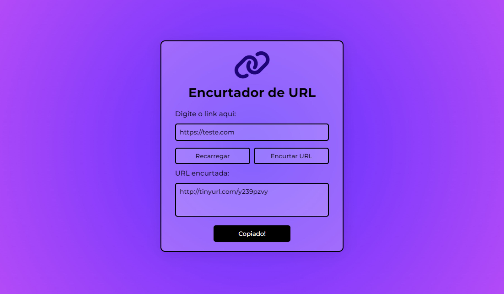

# App Encurtador de URL

## Sobre o projeto

Um apicativo simples capaz de encurtar uma url ou link fornecido pelo usuário.

## Como utilizar

Basta digitar o link no campo indicado e clicar na opção encurtar. Também é possível copiar o link gerado diretamente para a área de transferencia.

## Informações

Projeto desenvolvido utilizando apenas HTML, CSS e JavaScript.

## Demonstração

https://app-url-shortner.vercel.app/

